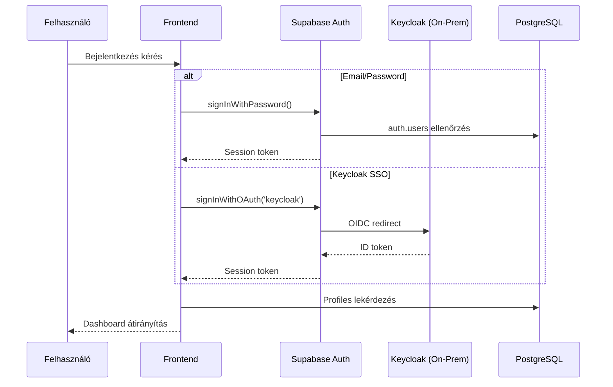

# HealthPass Wellbeing - Műszaki Rendszerleírás

> **Verzió:** 1.0  
> **Dátum:** 2025. január 19.  
> **Platform:** Lovable Cloud (Supabase backend)

---

## Tartalomjegyzék

1. [Rendszer Áttekintés](#1-rendszer-áttekintés)
2. [Architektúra Áttekintés](#2-architektúra-áttekintés)
3. [Hitelesítési és Jogosultsági Rendszer](#3-hitelesítési-és-jogosultsági-rendszer)
4. [Adatbázis Séma](#4-adatbázis-séma)
5. [Szolgáltatás Logika (Service Logic)](#5-szolgáltatás-logika-service-logic)
6. [Állapotkezelés (State Management)](#6-állapotkezelés-state-management)
7. [API és Adatcsere Sémák](#7-api-és-adatcsere-sémák)
8. [Gamifikációs Rendszer](#8-gamifikációs-rendszer)
9. [Külső Integrációk](#9-külső-integrációk)
10. [Biztonsági Megfontolások](#10-biztonsági-megfontolások)
11. [Telepítési Konfiguráció](#11-telepítési-konfiguráció)

---

## 1. Rendszer Áttekintés

### 1.1 Alkalmazás Célja

A HealthPass Wellbeing egy egészségügyi webalkalmazás, amely:
- Kérdőívek kitöltését teszi lehetővé felhasználóknak
- Egészségügyi dokumentumok feltöltését és kezelését biztosítja
- Gamifikációs elemekkel (pontok, kitüntetések) ösztönzi az aktív részvételt
- GDPR-kompatibilis beleegyezés-kezelést valósít meg
- Medalyse integrációval labor- és viselhető eszköz adatokat jelenít meg

### 1.2 Technológiai Stack

| Réteg | Technológia |
|-------|-------------|
| **Frontend** | React 19, TypeScript, Vite |
| **Stílusok** | Tailwind CSS, shadcn/ui komponensek |
| **Állapotkezelés** | TanStack Query (React Query), React Context |
| **Backend** | Supabase (PostgreSQL, GoTrue Auth, Edge Functions) |
| **Hitelesítés** | Supabase Auth + Keycloak OIDC (on-prem) |
| **Routing** | React Router DOM v6 |

---

## 2. Architektúra Áttekintés

### 2.1 Komponens Hierarchia

```
┌─────────────────────────────────────────────────────────────────┐
│                           App.tsx                                │
│                    (Router, AuthProvider)                        │
└─────────────────────────────────────────────────────────────────┘
                              │
        ┌─────────────────────┼─────────────────────┐
        ▼                     ▼                     ▼
┌───────────────┐     ┌───────────────┐     ┌───────────────┐
│  Publikus     │     │  Védett       │     │  Admin        │
│  Útvonalak    │     │  Útvonalak    │     │  Útvonalak    │
├───────────────┤     ├───────────────┤     ├───────────────┤
│ /             │     │ /dashboard    │     │ /admin/*      │
│ /login        │     │ /healthbook/* │     │               │
│ /register     │     │ /settings     │     │               │
│ /consent      │     │ /points       │     │               │
└───────────────┘     └───────────────┘     └───────────────┘
        │                     │                     │
        │                     ▼                     │
        │             RequireConsent                │
        │             (Consent Gate)                │
        │                     │                     │
        └─────────────────────┼─────────────────────┘
                              ▼
                    ┌───────────────┐
                    │ Supabase      │
                    │ Backend       │
                    │ (PostgreSQL)  │
                    └───────────────┘
```

### 2.2 Szolgáltatás Függőségek

```
useAuth ──────────────┐
    │                 │
    ├── useConsent    │
    ├── usePoints     │
    ├── useAdminRole  │
    │       │         │
    │       ├── AdminLayout
    │       │
    ├── useQuestionnaireConfig
    │       │
    │       └── QuestionnaireWidget
    │
    ├── useActivityRewards ─── usePoints
    │
    ├── useUploadRewards ──── usePoints
    │
    └── useObservations ───── supabase.rpc()
```

---

## 3. Hitelesítési és Jogosultsági Rendszer

### 3.1 Hitelesítési Folyamat



### 3.2 AuthProvider Implementáció

**Fájl:** `src/hooks/useAuth.tsx`

```typescript
interface AuthContextType {
  user: User | null;
  session: Session | null;
  loading: boolean;
  authError: string | null;
  signUp: (email: string, password: string) => Promise<{ error: Error | null }>;
  signIn: (email: string, password: string) => Promise<{ error: Error | null }>;
  signInWithKeycloak: () => Promise<{ error: AuthError | null }>;
  signOut: () => Promise<void>;
  clearAuthError: () => void;
}
```

**Regisztráció során létrehozott profil:**
- `display_name`: Email @ előtti rész
- `age_range`: "Nincs megadva"
- `smoking_status`: "Nincs megadva"

### 3.3 Beleegyezés Kapu (Consent Gate)

**Fájl:** `src/components/RequireConsent.tsx`

Védett útvonalak előtt ellenőrzi:
1. Van-e bejelentkezett felhasználó
2. Rendelkezik-e érvényes beleegyezéssel (`health_data_processing = true` ÉS `research_participation = true`)

Ha bármelyik feltétel nem teljesül → `/consent` átirányítás

### 3.4 Admin Szerepkörök

**Táblázat:** `admin_roles`

| Szerepkör | Jogosultságok |
|-----------|---------------|
| `super_admin` | Minden admin funkció + szerepkör kezelés |
| `service_admin` | Kérdőív konfiguráció, felhasználói csoportok kezelése |

**Ellenőrző függvények:**

| Függvény | Leírás |
|----------|--------|
| `is_super_admin()` | Csak super_admin szerepkör |
| `is_service_admin()` | super_admin VAGY service_admin |
| `is_admin()` | admin_users táblában szerepel |
| `has_admin_role(user_id, role)` | Adott szerepkör ellenőrzése |

---

## 4. Adatbázis Séma

### 4.1 Fő Táblák és Kapcsolatok

```
┌─────────────────────┐
│   auth.users        │ (Supabase managed)
└─────────┬───────────┘
          │ id
          ▼
┌─────────────────────┐     ┌─────────────────────┐
│     profiles        │     │    admin_roles      │
│  - display_name     │     │  - role (enum)      │
│  - age_range        │     │  - user_id          │
│  - smoking_status   │     └─────────────────────┘
└─────────────────────┘
          │
          ├──────────────────┬──────────────────┐
          ▼                  ▼                  ▼
┌─────────────────┐  ┌─────────────────┐  ┌─────────────────┐
│  user_consents  │  │   user_points   │  │user_achievements│
│  - consent_v_id │  │  - points       │  │  - achievement_ │
│  - research_... │  │  - reason       │  │     id          │
│  - health_data_ │  │  - questionnaire│  │  - unlocked_at  │
└─────────────────┘  │     _id         │  └─────────────────┘
         │           └─────────────────┘           │
         ▼                                         ▼
┌─────────────────┐                      ┌─────────────────┐
│consent_versions │                      │  achievements   │
│  - version      │                      │  - name         │
│  - title        │                      │  - points_req   │
│  - content      │                      │  - icon         │
└─────────────────┘                      └─────────────────┘
```

### 4.2 Kérdőív Jogosultsági Rendszer

```
┌─────────────────────┐
│questionnaires_config│
│  - name             │
│  - description      │
│  - completion_time  │
│  - points           │
│  - target_url       │
│  - deadline         │
│  - is_active        │
└─────────┬───────────┘
          │ id
          ▼
┌─────────────────────┐     ┌─────────────────┐
│questionnaire_       │◄────│   user_groups   │
│  permissions        │     │  - name         │
│  - questionnaire_id │     │  - description  │
│  - group_id         │     └────────┬────────┘
│  - is_active        │              │
└─────────────────────┘              ▼
                              ┌─────────────────┐
                              │user_group_      │
                              │  members        │
                              │  - user_id      │
                              │  - group_id     │
                              └─────────────────┘
```

### 4.3 Gamifikációs Táblák

```
┌─────────────────────┐
│    reward_rules     │
│  - activity_type    │
│  - points           │
│  - frequency        │
│  - is_active        │
└─────────────────────┘

┌─────────────────────┐     ┌─────────────────┐
│user_activity_counts │     │  upload_rewards │
│  - user_id          │     │  - user_id      │
│  - activity_type    │     │  - upload_type  │
│  - total_count      │     │  - upload_date  │
│  - last_activity    │     │  - points_award │
└─────────────────────┘     └─────────────────┘

┌─────────────────────┐
│  badge_conditions   │
│  - achievement_id   │
│  - activity_type    │
│  - required_count   │
└─────────────────────┘
```

### 4.4 Enum Típusok

```sql
-- Tevékenység típusok
CREATE TYPE activity_type AS ENUM (
  'questionnaire_completion',
  'lab_upload',
  'discharge_upload',
  'patient_summary_upload',
  'observation_creation'
);

-- Admin szerepkörök
CREATE TYPE admin_role AS ENUM (
  'super_admin',
  'service_admin'
);

-- Jutalom gyakoriság
CREATE TYPE reward_frequency AS ENUM (
  'per_event',    -- Minden eseménynél
  'daily',        -- Naponta egyszer
  'once_total'    -- Összesen egyszer
);
```

---

## 5. Szolgáltatás Logika (Service Logic)

### 5.1 Kérdőív Elérhetőség Logika

**RPC Függvény:** `get_user_questionnaires()`

```sql
SELECT DISTINCT qc.*
FROM questionnaires_config qc
JOIN questionnaire_permissions qp ON qc.id = qp.questionnaire_id
JOIN user_group_members ugm ON qp.group_id = ugm.group_id
WHERE ugm.user_id = auth.uid()
  AND qc.is_active = true
  AND (qp.is_active IS NULL OR qp.is_active = true)
  AND (qc.deadline IS NULL OR qc.deadline > now())
ORDER BY qc.created_at DESC
```

**Szűrési feltételek:**
1. Felhasználó csoporttagsága (`user_group_members`)
2. Csoport-kérdőív hozzárendelés (`questionnaire_permissions`)
3. Kérdőív aktív státusza (`is_active = true`)
4. Hozzárendelés aktív státusza (`qp.is_active = true`)
5. Határidő nem járt le (`deadline > now()`)

### 5.2 Pontjóváírás Logika

**RPC Függvény:** `award_activity_points(activity_type, description)`

```
┌─────────────────────────────────────────────────────────────┐
│                  award_activity_points()                     │
└─────────────────────────────────────────────────────────────┘
                              │
                              ▼
                    ┌───────────────────┐
                    │ reward_rules      │
                    │ lekérdezés        │
                    │ (activity_type)   │
                    └─────────┬─────────┘
                              │
              ┌───────────────┼───────────────┐
              ▼               ▼               ▼
       ┌──────────┐    ┌──────────┐    ┌──────────┐
       │per_event │    │  daily   │    │once_total│
       │  Mindig  │    │ Naponta  │    │ Egyszer  │
       │jóváírás  │    │ egyszer  │    │összesen  │
       └────┬─────┘    └────┬─────┘    └────┬─────┘
            │               │               │
            └───────────────┼───────────────┘
                            ▼
                  ┌───────────────────┐
                  │ user_activity_    │
                  │ counts frissítés  │
                  └─────────┬─────────┘
                            │
                            ▼
                  ┌───────────────────┐
                  │ user_points       │
                  │ beszúrás          │
                  └─────────┬─────────┘
                            │
                            ▼
                  ┌───────────────────┐
                  │ Kitüntetések      │
                  │ ellenőrzése       │
                  │ (achievements)    │
                  └─────────┬─────────┘
                            │
                            ▼
                  ┌───────────────────┐
                  │ user_achievements │
                  │ beszúrás (ha új)  │
                  └───────────────────┘
```

**Visszatérési érték:**
```typescript
{
  success: boolean;
  points_awarded?: number;
  total_points?: number;
  new_achievements?: Achievement[];
  error?: string;
  already_rewarded?: boolean;
}
```

### 5.3 Feltöltés Jutalom Logika

**RPC Függvény:** `award_upload_points(upload_type, points)`

- Napi korlátozás típusonként
- `upload_rewards` táblában követés
- Alapértelmezett pont: 30

### 5.4 Beleegyezés Kezelés

**Munkafolyamat:**

```
Bejelentkezés
     │
     ▼
┌─────────────────┐
│ useConsent()    │
│ fetchConsentData│
└────────┬────────┘
         │
         ▼
┌─────────────────┐     ┌─────────────────┐
│consent_versions │────▶│ Legújabb verzió │
│ lekérdezés      │     │ azonosítás      │
└─────────────────┘     └────────┬────────┘
                                 │
                                 ▼
                        ┌─────────────────┐
                        │user_consents    │
                        │ ellenőrzés      │
                        └────────┬────────┘
                                 │
                    ┌────────────┴────────────┐
                    ▼                         ▼
            ┌───────────────┐         ┌───────────────┐
            │Van érvényes   │         │Nincs érvényes │
            │beleegyezés    │         │beleegyezés    │
            └───────┬───────┘         └───────┬───────┘
                    │                         │
                    ▼                         ▼
            ┌───────────────┐         ┌───────────────┐
            │ Dashboard     │         │ /consent      │
            │ megjelenítés  │         │ átirányítás   │
            └───────────────┘         └───────────────┘
```

---

## 6. Állapotkezelés (State Management)

### 6.1 Globális Állapotok

| Hook | Perzisztencia | Frissítési Mód |
|------|---------------|----------------|
| `useAuth` | Supabase Session (localStorage) | Auth események |
| `useConsent` | Supabase DB | Manuális refetch |
| `usePoints` | Supabase DB | Manuális refetch |
| `useObservations` | localStorage (user_id prefix) | Azonnali |

### 6.2 React Query Cache Konfiguráció

```typescript
// Admin data hooks
queryKey: ["admin", "profiles"]
queryKey: ["admin", "consents"]
queryKey: ["admin", "points"]
queryKey: ["admin", "achievements"]
queryKey: ["admin", "audit-events", limit]
queryKey: ["admin", "dashboard-stats"]
```

### 6.3 Komponens Állapot Áramlás

```
┌─────────────────────────────────────────────────────────────┐
│                     AuthProvider                             │
│  ┌─────────────────────────────────────────────────────────┐│
│  │ user, session, loading, authError                       ││
│  └─────────────────────────────────────────────────────────┘│
└─────────────────────────────────────────────────────────────┘
                              │
         ┌────────────────────┼────────────────────┐
         ▼                    ▼                    ▼
┌─────────────────┐  ┌─────────────────┐  ┌─────────────────┐
│  useConsent()   │  │   usePoints()   │  │ useAdminRole()  │
│  - latestVer    │  │  - totalPoints  │  │  - role         │
│  - userConsent  │  │  - achievements │  │  - isSuperAdmin │
│  - needsConsent │  │  - unlocked     │  │  - isService... │
└─────────────────┘  └─────────────────┘  └─────────────────┘
         │                    │                    │
         ▼                    ▼                    ▼
┌─────────────────────────────────────────────────────────────┐
│                    UI Komponensek                            │
└─────────────────────────────────────────────────────────────┘
```

---

## 7. API és Adatcsere Sémák

### 7.1 Supabase RPC Függvények

| Függvény | Paraméterek | Visszatérés |
|----------|-------------|-------------|
| `get_user_questionnaires` | - | `questionnaires_config[]` |
| `add_user_points` | `p_points, p_reason, p_questionnaire_id` | `JSON` |
| `award_activity_points` | `p_activity_type, p_description` | `JSON` |
| `award_upload_points` | `p_upload_type, p_points` | `JSON` |
| `check_is_admin` | - | `boolean` |
| `is_super_admin` | - | `boolean` |
| `is_service_admin` | - | `boolean` |
| `has_admin_role` | `_user_id, _role` | `boolean` |
| `log_audit_event` | `p_event_type, p_metadata` | `void` |

### 7.2 Adatmodellek (TypeScript)

```typescript
// Kérdőív konfiguráció
interface QuestionnaireConfig {
  id: string;
  name: string;
  description: string | null;
  completion_time: number;
  points: number;
  target_url: string;
  deadline: string | null;
  is_active: boolean;
  // Kliens oldali kiegészítések
  status: QuestionnaireStatus;
  started_at?: string;
  completed_at?: string;
}

type QuestionnaireStatus = 'not_started' | 'in_progress' | 'completed';

// Felhasználói beleegyezés
interface UserConsent {
  id: string;
  consent_version_id: string;
  research_participation: boolean;
  health_data_processing: boolean;
  communication_preferences: boolean;
  consented_at: string;
  withdrawn_at: string | null;
}

// Kitüntetés
interface Achievement {
  id: string;
  name: string;
  description: string;
  icon: string;
  points_required: number;
  min_points_threshold: number | null;
}

// Megfigyelés (lokális)
interface Observation {
  id: string;
  date: string;
  category: ObservationCategory;
  value: string;
  note: string;
  createdAt: string;
}

type ObservationCategory = 
  | 'mood' 
  | 'energy' 
  | 'sleep' 
  | 'headache' 
  | 'pain' 
  | 'note';
```

### 7.3 Audit Események

| Eseménytípus | Metaadat |
|--------------|----------|
| `user_registered` | `{ email }` |
| `consent_submitted` | `{ version_id, consents }` |
| `questionnaire_completed` | `{ questionnaire_id, points }` |
| `points_added` | `{ points, reason }` |
| `admin_added` | `{ target_email }` |
| `admin_removed` | `{ target_email }` |

---

## 8. Gamifikációs Rendszer

### 8.1 Tevékenység Típusok és Alapértelmezett Pontok

| Tevékenység | Magyar Címke | Frekvencia |
|-------------|--------------|------------|
| `questionnaire_completion` | Kérdőív kitöltése | per_event |
| `lab_upload` | Laboreredmény feltöltése | daily |
| `discharge_upload` | Zárójelentés feltöltése | daily |
| `patient_summary_upload` | Betegösszefoglaló feltöltése | daily |
| `observation_creation` | Saját megfigyelés rögzítése | per_event |

### 8.2 Kitüntetés Feloldási Logika

```sql
-- Kitüntetés feloldás ellenőrzése
FOR v_achievement IN 
  SELECT a.* FROM achievements a
  WHERE NOT EXISTS (
    SELECT 1 FROM user_achievements ua 
    WHERE ua.user_id = v_user_id AND ua.achievement_id = a.id
  )
LOOP
  -- 1. Pontküszöb ellenőrzés
  IF v_achievement.min_points_threshold IS NOT NULL 
     AND v_total_points < v_achievement.min_points_threshold THEN
    CONTINUE;
  END IF;
  
  -- 2. Legacy points_required ellenőrzés
  IF v_achievement.points_required > 0 
     AND v_total_points < v_achievement.points_required THEN
    CONTINUE;
  END IF;
  
  -- 3. Tevékenység alapú feltételek (badge_conditions)
  -- Minden feltételnek teljesülnie kell
  
  -- Feloldás, ha minden feltétel teljesül
  INSERT INTO user_achievements (user_id, achievement_id) ...
END LOOP;
```

---

## 9. Külső Integrációk

### 9.1 Medalyse Integráció

**Fájl:** `src/hooks/useMedalyseCompletion.tsx`

**Megbízható Originek:**
```typescript
const TRUSTED_MEDALYSE_ORIGINS = [
  "https://medalyse.com",
  "https://app.medalyse.com",
  "https://questionnaire.medalyse.com",
  // Fejlesztői mód: window.location.origin
];
```

**Kommunikáció:** `window.postMessage` API

### 9.2 Keycloak OIDC (On-Premises)

**Konfiguráció:** `window.appConfig.KEYCLOAK_REDIRECT_URI`

**Supabase Auth beállítások:**
```env
GOTRUE_EXTERNAL_KEYCLOAK_ENABLED=true
GOTRUE_EXTERNAL_KEYCLOAK_CLIENT_ID=${CLIENT_ID}
GOTRUE_EXTERNAL_KEYCLOAK_SECRET=${SECRET}
GOTRUE_EXTERNAL_KEYCLOAK_URL=${REALM_URL}
```

### 9.3 Cookie Consent Integráció

**Tárolás:** `localStorage.cookieConsent`

**Kategóriák:**
| Kategória | Leírás | Alapértelmezett |
|-----------|--------|-----------------|
| `necessary` | Szükséges sütik | Mindig aktív |
| `analytics` | Analitikai sütik | false |
| `marketing` | Marketing sütik | false |

---

## 10. Biztonsági Megfontolások

### 10.1 Row-Level Security (RLS) Politikák

Minden táblán engedélyezett RLS a következő mintával:

```sql
-- Felhasználó saját adatai
CREATE POLICY "Users can view own data" ON table_name
FOR SELECT USING (auth.uid() = user_id);

-- Admin hozzáférés
CREATE POLICY "Admins can view all" ON table_name
FOR SELECT USING (is_admin());

-- Csak backend módosítás
CREATE POLICY "Only backend can modify" ON table_name
FOR INSERT WITH CHECK (false);
```

### 10.2 SECURITY DEFINER Függvények

A következő függvények SECURITY DEFINER módban futnak (tulajdonos jogosultságaival):
- `is_super_admin()`
- `is_service_admin()`
- `has_admin_role()`
- `add_user_points()`
- `award_activity_points()`
- `award_upload_points()`
- `log_audit_event()`

### 10.3 Input Validáció

A backend RPC függvények validálják:
- Pont értékek (pozitív, max 1000)
- Szöveges mezők hossza (max 500 karakter)
- ID formátumok (alphanumerikus)
- Duplikált bejegyzések megelőzése

---

## 11. Telepítési Konfiguráció

### 11.1 Környezeti Változók

```env
# Supabase (automatikusan generált)
VITE_SUPABASE_URL=
VITE_SUPABASE_PUBLISHABLE_KEY=
VITE_SUPABASE_PROJECT_ID=

# Admin konfiguráció
VITE_ADMIN_EMAILS=admin@example.com

# On-Prem Keycloak (opcionális)
KEYCLOAK_REDIRECT_URI=
```

### 11.2 Runtime Konfiguráció (On-Prem)

```typescript
// window.appConfig injektálás
interface AppConfig {
  KEYCLOAK_REDIRECT_URI?: string;
}
```

### 11.3 Docker Compose Szolgáltatások

| Szolgáltatás | Port | Leírás |
|--------------|------|--------|
| nginx-proxy | 80, 443 | SSL termination, routing |
| frontend | - | React SPA |
| keycloak | - | OIDC Identity Provider |
| keycloak-db | - | Keycloak PostgreSQL |
| supabase-db | - | Alkalmazás PostgreSQL |
| supabase-auth | 9999 | GoTrue Auth szerver |
| supabase-rest | - | PostgREST API |
| supabase-kong | - | API Gateway |

---

## Mellékletek

### A. Útvonal Táblázat

| Útvonal | Komponens | Védelem | Leírás |
|---------|-----------|---------|--------|
| `/` | Landing | Publikus | Kezdőlap |
| `/login` | Login | Publikus | Bejelentkezés |
| `/register` | Register | Publikus | Regisztráció |
| `/consent` | Consent | Auth | Beleegyezés |
| `/dashboard` | Dashboard | Auth + Consent | Főoldal |
| `/healthbook` | HealthBook | Auth + Consent | Egészségkönyv |
| `/healthbook/labor` | HealthBookLabor | Auth + Consent | Labor adatok |
| `/healthbook/viselhetok` | HealthBookWearables | Auth + Consent | Viselhető eszközök |
| `/healthbook/dokumentumok` | HealthBookDocuments | Auth + Consent | Dokumentumok |
| `/pontok` | PointsHistory | Auth + Consent | Pont előzmények |
| `/settings` | Settings | Auth + Consent | Beállítások |
| `/cookie-szabalyzat` | CookiePolicy | Publikus | Cookie szabályzat |
| `/admin/*` | AdminLayout | Auth + Admin | Admin felület |

### B. Admin Oldalak

| Útvonal | Jogosultság | Funkció |
|---------|-------------|---------|
| `/admin` | is_admin | Dashboard |
| `/admin/felhasznalok` | is_admin | Felhasználók |
| `/admin/hozzajarulasok` | is_admin | Beleegyezések |
| `/admin/hozzajarulas-verziok` | is_admin | Beleegyezés verziók |
| `/admin/pontok` | is_admin | Pontok |
| `/admin/kerdoivek` | is_service_admin | Kérdőívek |
| `/admin/felhasznalo-csoportok` | is_service_admin | Csoportok |
| `/admin/jutalom-szabalyok` | is_service_admin | Jutalom szabályok |
| `/admin/eredmenyek` | is_admin | Kitüntetések |
| `/admin/feltoltesek` | is_admin | Feltöltések |
| `/admin/adminok` | is_admin | Adminok |
| `/admin/szerepkorok` | is_super_admin | Szerepkörök |
| `/admin/audit-log` | is_admin | Audit napló |

---

*Dokumentum vége*
