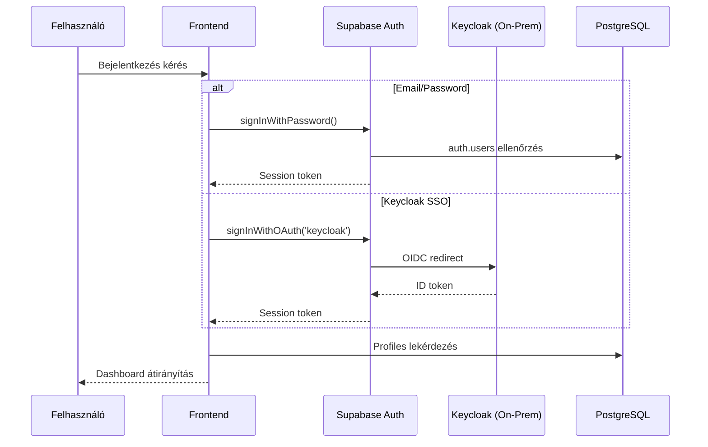

# HealthPass Wellbeing - Műszaki Rendszerleírás

> **Verzió:** 2.1  
> **Dátum:** 2026. február 4.  
> **Platform:** Lovable Cloud (Supabase backend)  
> **Projekt azonosító:** jqdrjpywgcfbdhscrixr

---

## Tartalomjegyzék

1. [Rendszer Áttekintés](#1-rendszer-áttekintés)
2. [Architektúra Áttekintés](#2-architektúra-áttekintés)
3. [Hitelesítési és Jogosultsági Rendszer](#3-hitelesítési-és-jogosultsági-rendszer)
4. [Adatbázis Séma](#4-adatbázis-séma)
5. [Szolgáltatás Logika (Service Logic)](#5-szolgáltatás-logika-service-logic)
6. [Állapotkezelés (State Management)](#6-állapotkezelés-state-management)
7. [API és Adatcsere Sémák](#7-api-és-adatcsere-sémák)
8. [Gamifikációs Rendszer](#8-gamifikációs-rendszer)
9. [Külső Integrációk](#9-külső-integrációk)
10. [Biztonsági Megfontolások](#10-biztonsági-megfontolások)
11. [Telepítési Konfiguráció](#11-telepítési-konfiguráció)
12. [Hook Referencia](#12-hook-referencia)

---

## 1. Rendszer Áttekintés

### 1.1 Alkalmazás Célja

A HealthPass Wellbeing egy közösségi jóllét és dohányzás-prevenciós platform, amely:
- **NEM** orvosi eszköz és nem tartalmaz diagnózist, kezelési javaslatot vagy kockázatértékelést
- Kérdőívek kitöltését teszi lehetővé felhasználóknak kutatási célokra
- Egészségügyi dokumentumok feltöltését és kezelését biztosítja
- Gamifikációs elemekkel (pontok, kitüntetések) ösztönzi az aktív részvételt
- GDPR-kompatibilis beleegyezés-kezelést valósít meg
- Medalyse integrációval labor- és viselhető eszköz adatokat jelenít meg

### 1.2 Platform Modulok

| Modul | Leírás | Útvonal |
|-------|--------|---------|
| **SurveyStore** | Kérdőívek kitöltése, pont gyűjtés | `/dashboard`, `/kerdoiv/:id` |
| **HealthBook** | Személyes egészségügyi adatok tárolása | `/healthbook/*` |
| **HealthGuide** | Biztonságos, nem-orvosi értelmezések (jövőbeli) | - |
| **HealthPass** | Személyes asszisztens (jövőbeli) | - |
| **HealthMarket** | Jóllét ajánlatok jutalmakért (jövőbeli) | - |

### 1.3 Technológiai Stack

| Réteg | Technológia | Verzió |
|-------|-------------|--------|
| **Frontend** | React, TypeScript, Vite | 19.x |
| **Stílusok** | Tailwind CSS, shadcn/ui | - |
| **Állapotkezelés** | TanStack Query, React Context | 5.x |
| **Backend** | Supabase (PostgreSQL, GoTrue Auth) | - |
| **Hitelesítés** | Supabase Auth + Keycloak OIDC (on-prem) | - |
| **Routing** | React Router DOM | 6.x |
| **Űrlapkezelés** | React Hook Form + Zod | 7.x |

### 1.4 Nyelvi Követelmény

**KRITIKUS:** Minden felhasználói felület szövege kizárólag MAGYAR nyelvű. Ez vonatkozik:
- Minden komponensre és oldalra
- Toast üzenetekre és hibaüzenetekre
- Validációs üzenetekre
- Címkékre és gombokra
- Adatbázisból jövő metaadatokra

---

## 2. Architektúra Áttekintés

### 2.1 Komponens Hierarchia

```
┌─────────────────────────────────────────────────────────────────┐
│                           App.tsx                                │
│         (QueryClientProvider, AuthProvider, BrowserRouter)       │
└─────────────────────────────────────────────────────────────────┘
                              │
        ┌─────────────────────┼─────────────────────┐
        ▼                     ▼                     ▼
┌───────────────┐     ┌───────────────┐     ┌───────────────┐
│  Publikus     │     │  Védett       │     │  Admin        │
│  Útvonalak    │     │  Útvonalak    │     │  Útvonalak    │
├───────────────┤     ├───────────────┤     ├───────────────┤
│ /             │     │ /dashboard    │     │ /admin/*      │
│ /login        │     │ /healthbook/* │     │               │
│ /register     │     │ /settings     │     │               │
│ /consent      │     │ /pontok       │     │               │
│ /cookie-...   │     │ /kerdoiv/:id  │     │               │
└───────────────┘     └───────────────┘     └───────────────┘
        │                     │                     │
        │                     ▼                     │
        │             RequireConsent                │
        │             (Consent Gate)                │
        │                     │                     │
        └─────────────────────┼─────────────────────┘
                              ▼
                    ┌───────────────┐
                    │ Supabase      │
                    │ Backend       │
                    │ (PostgreSQL)  │
                    └───────────────┘
```

### 2.2 Hook Függőségi Gráf

```
┌─────────────────────────────────────────────────────────────────┐
│                         useAuth                                  │
│        (User, Session, SignIn, SignOut, SignUp)                  │
└─────────────────────────────────────────────────────────────────┘
                              │
    ┌───────────┬─────────────┼─────────────┬───────────┐
    ▼           ▼             ▼             ▼           ▼
┌─────────┐ ┌─────────┐ ┌─────────────┐ ┌─────────┐ ┌─────────┐
│useConsent│ │usePoints│ │useAdminRole │ │useAdmin │ │useQuest-│
│          │ │         │ │             │ │         │ │ionnaire │
└─────────┘ └────┬────┘ └─────────────┘ └─────────┘ │Config   │
                 │                                   └────┬────┘
    ┌────────────┼────────────┐                          │
    ▼            ▼            ▼                          ▼
┌─────────┐ ┌─────────┐ ┌─────────────┐         ┌─────────────┐
│useActi- │ │useUpload│ │useObserva-  │         │useMedalyse- │
│vityRe-  │ │Rewards  │ │tions        │         │Completion   │
│wards    │ │         │ │             │         │             │
└─────────┘ └─────────┘ └─────────────┘         └─────────────┘
```

### 2.3 Adatfolyam Diagram

```
┌─────────────────────────────────────────────────────────────────┐
│                    Frontend (React)                              │
├─────────────────────────────────────────────────────────────────┤
│  Hooks (useAuth, usePoints, useConsent, ...)                     │
│       │                                                          │
│       ▼                                                          │
│  Supabase Client (@/integrations/supabase/client)                │
└──────────────────────────┬──────────────────────────────────────┘
                           │ HTTPS
                           ▼
┌─────────────────────────────────────────────────────────────────┐
│                    Supabase Backend                              │
├─────────────────────────────────────────────────────────────────┤
│  ┌─────────────┐  ┌─────────────┐  ┌─────────────────────────┐  │
│  │ PostgREST   │  │ GoTrue Auth │  │ PostgreSQL              │  │
│  │ (REST API)  │  │ (Sessions)  │  │ (RLS Policies)          │  │
│  └─────────────┘  └─────────────┘  └─────────────────────────┘  │
│                                                                  │
│  ┌─────────────────────────────────────────────────────────────┐│
│  │                 Database Functions (RPC)                     ││
│  │  - add_user_points()      - award_activity_points()         ││
│  │  - get_user_questionnaires()  - award_upload_points()       ││
│  │  - is_admin() / is_super_admin() / is_service_admin()       ││
│  └─────────────────────────────────────────────────────────────┘│
└─────────────────────────────────────────────────────────────────┘
```

---

## 3. Hitelesítési és Jogosultsági Rendszer

### 3.1 Hitelesítési Folyamat



### 3.2 AuthProvider Implementáció

**Fájl:** `src/hooks/useAuth.tsx`

```typescript
interface AuthContextType {
  user: User | null;
  session: Session | null;
  loading: boolean;
  authError: string | null;
  signUp: (email: string, password: string) => Promise<{ error: Error | null }>;
  signIn: (email: string, password: string) => Promise<{ error: Error | null }>;
  signInWithKeycloak: () => Promise<{ error: AuthError | null }>;
  signOut: () => Promise<void>;
  clearAuthError: () => void;
}
```

**Regisztráció során létrehozott profil:**
- `display_name`: Email @ előtti rész
- `age_range`: "Nincs megadva"
- `smoking_status`: "Nincs megadva"

**Automatikus csoport hozzárendelés:**
- Trigger: `add_user_to_default_group()`
- Minden új felhasználó az `all_users` csoportba kerül

### 3.3 Beleegyezés Kapu (Consent Gate)

**Fájl:** `src/components/RequireConsent.tsx`

Védett útvonalak előtt ellenőrzi:
1. Van-e bejelentkezett felhasználó
2. Rendelkezik-e érvényes beleegyezéssel:
   - `health_data_processing = true` **ÉS**
   - `research_participation = true`

Ha bármelyik feltétel nem teljesül → `/consent` átirányítás

### 3.4 Admin Szerepkör Hierarchia

```
┌─────────────────────────────────────────┐
│            super_admin                   │
│  (Minden jogosultság + szerepkör kezelés)│
└────────────────────┬────────────────────┘
                     │
                     ▼
┌─────────────────────────────────────────┐
│           service_admin                  │
│  (Kérdőív, csoport, jutalom kezelés)     │
└────────────────────┬────────────────────┘
                     │
                     ▼
┌─────────────────────────────────────────┐
│           admin (admin_users)            │
│  (Alapvető admin hozzáférés)             │
└─────────────────────────────────────────┘
```

**Ellenőrző függvények (SQL):**

| Függvény | Leírás | Használat |
|----------|--------|-----------|
| `is_super_admin()` | Csak super_admin | Szerepkör kezelés |
| `is_service_admin()` | super_admin VAGY service_admin | Kérdőív/csoport kezelés |
| `is_admin()` | admin_users táblában szerepel | Általános admin |
| `has_admin_role(user_id, role)` | Adott szerepkör ellenőrzése | Specifikus ellenőrzés |

---

## 4. Adatbázis Séma

### 4.1 Felhasználói Adatok

```
┌─────────────────────┐
│   auth.users        │ (Supabase managed - NEM MÓDOSÍTHATÓ)
└─────────┬───────────┘
          │ id
          ▼
┌─────────────────────┐     ┌─────────────────────┐
│     profiles        │     │    admin_roles      │
│  - id (= auth.uid)  │     │  - role (enum)      │
│  - display_name     │     │  - user_id          │
│  - age_range        │     └─────────────────────┘
│  - smoking_status   │
│  - created_at       │     ┌─────────────────────┐
│  - updated_at       │     │    admin_users      │
└─────────────────────┘     │  - email            │
                            │  - user_id (linked) │
                            └─────────────────────┘
```

### 4.2 Beleegyezés Rendszer

```
┌─────────────────────┐
│  consent_versions   │
│  - id               │
│  - version (text)   │
│  - title            │
│  - content          │
│  - effective_date   │
└─────────┬───────────┘
          │
          ▼
┌─────────────────────────────────────┐
│         user_consents               │
│  - user_id                          │
│  - consent_version_id (FK)          │
│  - research_participation (bool)    │
│  - health_data_processing (bool)    │
│  - communication_preferences (bool) │
│  - consented_at                     │
│  - withdrawn_at (nullable)          │
│  - ip_address                       │
│  - user_agent                       │
└─────────────────────────────────────┘
```

### 4.3 Kérdőív Jogosultsági Rendszer

```
┌─────────────────────────────────────┐
│       questionnaires_config         │
│  - id                               │
│  - name                             │
│  - description                      │
│  - completion_time (perc)           │
│  - points                           │
│  - target_url                       │
│  - deadline                         │
│  - is_active                        │
└─────────────┬───────────────────────┘
              │ id
              ▼
┌─────────────────────────┐     ┌─────────────────────────┐
│questionnaire_permissions│────▶│      user_groups        │
│  - questionnaire_id (FK)│     │  - id                   │
│  - group_id (FK)        │     │  - name                 │
└─────────────────────────┘     │  - description          │
                                └───────────┬─────────────┘
                                            │
                                            ▼
                                ┌─────────────────────────┐
                                │   user_group_members    │
                                │  - user_id              │
                                │  - group_id (FK)        │
                                └─────────────────────────┘
```

### 4.4 Kérdőív Haladás Követés

```
┌─────────────────────────────────────┐
│    user_questionnaire_progress      │
│  - id                               │
│  - user_id                          │
│  - questionnaire_id (FK)            │
│  - status (not_started/in_progress/ │
│            completed)               │
│  - started_at                       │
│  - completed_at                     │
│  - created_at                       │
│  - updated_at                       │
└─────────────────────────────────────┘
      │
      │ UNIQUE CONSTRAINT: (user_id, questionnaire_id)
```

### 4.5 Gamifikációs Rendszer

```
┌───────────────────────────────────────────────────────────────┐
│                      reward_rules                              │
│  - activity_type (enum)                                        │
│  - points                                                      │
│  - frequency (per_event/daily/once_total)                      │
│  - is_active                                                   │
└───────────────────────────────────────────────────────────────┘

┌─────────────────────────┐     ┌─────────────────────────┐
│      user_points        │     │    upload_rewards       │
│  - user_id              │     │  - user_id              │
│  - points               │     │  - upload_type          │
│  - reason               │     │  - upload_date          │
│  - questionnaire_id     │     │  - points_awarded       │
│  - created_at           │     └─────────────────────────┘
└─────────────────────────┘

┌─────────────────────────┐     ┌─────────────────────────┐
│user_activity_counts     │     │     achievements        │
│  - user_id              │     │  - id                   │
│  - activity_type        │     │  - name                 │
│  - total_count          │     │  - description          │
│  - last_activity_date   │     │  - icon                 │
└─────────────────────────┘     │  - points_required      │
                                │  - min_points_threshold │
                                └───────────┬─────────────┘
                                            │
                                            ▼
                                ┌─────────────────────────┐
                                │   badge_conditions      │
                                │  - achievement_id (FK)  │
                                │  - activity_type        │
                                │  - required_count       │
                                └─────────────────────────┘

┌─────────────────────────┐
│   user_achievements     │
│  - user_id              │
│  - achievement_id (FK)  │
│  - unlocked_at          │
└─────────────────────────┘
```

### 4.6 Gomb Konfigurációk

```
┌─────────────────────────────────────┐
│        button_configs               │
│  - gomb_azonosito (PK, text)        │  ← "q_{questionnaire_id}" formátum
│  - button_label                     │
│  - tooltip                          │
│  - target_url                       │
│  - url_target (_blank/_self)        │
│  - created_at                       │
│  - updated_at                       │
└─────────────────────────────────────┘
```

### 4.7 Enum Típusok

```sql
-- Tevékenység típusok
CREATE TYPE activity_type AS ENUM (
  'questionnaire_completion',
  'lab_upload',
  'discharge_upload',
  'patient_summary_upload',
  'observation_creation'
);

-- Admin szerepkörök
CREATE TYPE admin_role AS ENUM (
  'super_admin',
  'service_admin'
);

-- Jutalom gyakoriság
CREATE TYPE reward_frequency AS ENUM (
  'per_event',    -- Minden eseménynél
  'daily',        -- Naponta egyszer
  'once_total'    -- Összesen egyszer
);

-- URL target típusok
CREATE TYPE url_target_type AS ENUM (
  '_blank',       -- Új ablak
  '_self'         -- Ugyanaz az ablak
);
```

---

## 5. Szolgáltatás Logika (Service Logic)

### 5.1 Kérdőív Elérhetőségi Logika

**RPC Függvény:** `get_user_questionnaires()`

```sql
SELECT DISTINCT qc.*
FROM questionnaires_config qc
JOIN questionnaire_permissions qp ON qc.id = qp.questionnaire_id
JOIN user_group_members ugm ON qp.group_id = ugm.group_id
WHERE ugm.user_id = auth.uid()
  AND qc.is_active = true
  AND (qc.deadline IS NULL OR qc.deadline > now())
ORDER BY qc.created_at DESC
```

**Szűrési feltételek (sorrendben):**

```
┌─────────────────────────────────────────────────────────────────┐
│ 1. Felhasználó csoporttagsága (user_group_members)               │
│    └─► user_id = auth.uid()                                      │
├─────────────────────────────────────────────────────────────────┤
│ 2. Csoport-kérdőív hozzárendelés (questionnaire_permissions)     │
│    └─► group_id kapcsolat                                        │
├─────────────────────────────────────────────────────────────────┤
│ 3. Kérdőív aktív státusza                                        │
│    └─► is_active = true                                          │
├─────────────────────────────────────────────────────────────────┤
│ 4. Határidő nem járt le                                          │
│    └─► deadline IS NULL OR deadline > now()                      │
└─────────────────────────────────────────────────────────────────┘
```

### 5.2 Kérdőív Kitöltés Munkafolyamat

```
┌─────────────────────────────────────────────────────────────────┐
│                    Felhasználó                                   │
└───────────────────────────┬─────────────────────────────────────┘
                            │
                            ▼
┌─────────────────────────────────────────────────────────────────┐
│ 1. Dashboard - QuestionnaireWidget kattintás                     │
│    └─► button_configs alapján gomb megjelenítés                  │
│    └─► /kerdoiv/:id navigáció                                    │
└───────────────────────────┬─────────────────────────────────────┘
                            │
                            ▼
┌─────────────────────────────────────────────────────────────────┐
│ 2. QuestionnairePage betöltés                                    │
│    └─► useQuestionnaireConfig() - kérdőív adatok                 │
│    └─► useButtonConfigs() - gomb konfiguráció                    │
│    └─► useMedalyseCompletion() - esemény figyelő                 │
└───────────────────────────┬─────────────────────────────────────┘
                            │
                            ▼
┌─────────────────────────────────────────────────────────────────┐
│ 3. "Kitöltés" gomb - startQuestionnaire()                        │
│    └─► user_questionnaire_progress UPSERT                        │
│    └─► status: 'in_progress', started_at: now()                  │
│    └─► target_url megnyitása (iframe/új ablak)                   │
└───────────────────────────┬─────────────────────────────────────┘
                            │
                            ▼
┌─────────────────────────────────────────────────────────────────┐
│ 4. Medalyse webkomponens kitöltés                                │
│    └─► Külső szolgáltató kezeli a kérdőívet                      │
└───────────────────────────┬─────────────────────────────────────┘
                            │
                            ▼
┌─────────────────────────────────────────────────────────────────┐
│ 5. Kitöltés befejezése - Esemény fogadás                         │
│    └─► "medalyse:questionnaireCompleted" CustomEvent VAGY        │
│    └─► window.postMessage({ type: "QUESTIONNAIRE_COMPLETED" })   │
└───────────────────────────┬─────────────────────────────────────┘
                            │
                            ▼
┌─────────────────────────────────────────────────────────────────┐
│ 6. useMedalyseCompletion callback                                │
│    └─► Origin ellenőrzés (TRUSTED_MEDALYSE_ORIGINS)              │
│    └─► completeQuestionnaire(id) - státusz frissítés             │
│    └─► addPoints() - pont jóváírás                               │
│    └─► Toast megjelenítés (siker/achievement)                    │
└─────────────────────────────────────────────────────────────────┘
```

**KRITIKUS:** Manuális "Befejezés" gomb TILOS! A kitöltés kizárólag eseményvezérelt.

### 5.3 Pontjóváírás Logika

**RPC Függvény:** `award_activity_points(activity_type, description)`

```
┌─────────────────────────────────────────────────────────────────┐
│                  award_activity_points()                         │
└───────────────────────────┬─────────────────────────────────────┘
                            │
                            ▼
┌─────────────────────────────────────────────────────────────────┐
│ 1. Hitelesítés ellenőrzés                                        │
│    └─► auth.uid() IS NOT NULL                                    │
└───────────────────────────┬─────────────────────────────────────┘
                            │
                            ▼
┌─────────────────────────────────────────────────────────────────┐
│ 2. Validáció                                                     │
│    └─► p_description max 500 karakter                            │
│    └─► reward_rules lekérdezés (activity_type, is_active)        │
└───────────────────────────┬─────────────────────────────────────┘
                            │
                            ▼
┌─────────────────────────────────────────────────────────────────┐
│ 3. Frekvencia ellenőrzés                                         │
├─────────────────────────────────────────────────────────────────┤
│ per_event    → Mindig jóváírás                                   │
│ daily        → last_activity_date < today → jóváírás             │
│ once_total   → total_count = 0 → jóváírás                        │
└───────────────────────────┬─────────────────────────────────────┘
                            │
                            ▼
┌─────────────────────────────────────────────────────────────────┐
│ 4. user_activity_counts frissítés                                │
│    └─► total_count++, last_activity_date = today                 │
└───────────────────────────┬─────────────────────────────────────┘
                            │
                            ▼ (ha v_can_reward = true)
┌─────────────────────────────────────────────────────────────────┐
│ 5. user_points beszúrás                                          │
│    └─► points = reward_rules.points                              │
│    └─► reason = leírás (magyar)                                  │
└───────────────────────────┬─────────────────────────────────────┘
                            │
                            ▼
┌─────────────────────────────────────────────────────────────────┐
│ 6. Kitüntetés ellenőrzés                                         │
│    └─► achievements WHERE NOT IN user_achievements               │
│    └─► min_points_threshold ellenőrzés                           │
│    └─► badge_conditions ellenőrzés (activity_type, count)        │
│    └─► Feloldás ha minden feltétel teljesül                      │
└───────────────────────────┬─────────────────────────────────────┘
                            │
                            ▼
┌─────────────────────────────────────────────────────────────────┐
│ 7. JSON visszatérés                                              │
│    └─► success, points_awarded, total_points, new_achievements   │
└─────────────────────────────────────────────────────────────────┘
```

### 5.4 Feltöltés Jutalom Logika

**RPC Függvény:** `award_upload_points(upload_type, points)`

```
┌─────────────────────────────────────────────────────────────────┐
│                  award_upload_points()                           │
└───────────────────────────┬─────────────────────────────────────┘
                            │
                            ▼
┌─────────────────────────────────────────────────────────────────┐
│ 1. Validáció                                                     │
│    └─► upload_type: max 50 karakter, alphanumerikus              │
│    └─► points: 0 < points <= 1000                                │
└───────────────────────────┬─────────────────────────────────────┘
                            │
                            ▼
┌─────────────────────────────────────────────────────────────────┐
│ 2. Napi limit ellenőrzés                                         │
│    └─► upload_rewards WHERE user_id AND upload_type              │
│    └─► AND upload_date = CURRENT_DATE                            │
│    └─► Ha létezik → already_rewarded = true                      │
└───────────────────────────┬─────────────────────────────────────┘
                            │
                            ▼ (ha nem rewarded)
┌─────────────────────────────────────────────────────────────────┐
│ 3. upload_rewards beszúrás                                       │
│    └─► user_id, upload_type, upload_date, points_awarded         │
└───────────────────────────┬─────────────────────────────────────┘
                            │
                            ▼
┌─────────────────────────────────────────────────────────────────┐
│ 4. add_user_points() meghívása                                   │
│    └─► reason: "Dokumentum feltöltés: {upload_type}"             │
└─────────────────────────────────────────────────────────────────┘
```

### 5.5 Beleegyezés Kezelés

```
┌─────────────────────────────────────────────────────────────────┐
│                    Bejelentkezés                                 │
└───────────────────────────┬─────────────────────────────────────┘
                            │
                            ▼
┌─────────────────────────────────────────────────────────────────┐
│ useConsent() - fetchConsentData()                                │
│    └─► consent_versions ORDER BY effective_date DESC LIMIT 1     │
│    └─► user_consents WHERE user_id AND consent_version_id        │
│        AND withdrawn_at IS NULL                                  │
└───────────────────────────┬─────────────────────────────────────┘
                            │
            ┌───────────────┼───────────────┐
            ▼                               ▼
┌───────────────────────┐       ┌───────────────────────┐
│ Van érvényes          │       │ Nincs érvényes        │
│ beleegyezés           │       │ beleegyezés           │
│ (health_data +        │       │                       │
│  research = true)     │       │                       │
└───────────┬───────────┘       └───────────┬───────────┘
            │                               │
            ▼                               ▼
┌───────────────────────┐       ┌───────────────────────┐
│ RequireConsent        │       │ /consent átirányítás  │
│ → children render     │       │                       │
└───────────────────────┘       └───────────────────────┘
```

### 5.6 Automatikus Szinkronizáció

**Trigger:** `sync_button_config_after_questionnaire_insert()`

```
┌─────────────────────────────────────────────────────────────────┐
│ questionnaires_config INSERT                                     │
└───────────────────────────┬─────────────────────────────────────┘
                            │
                            ▼
┌─────────────────────────────────────────────────────────────────┐
│ button_configs INSERT                                            │
│    └─► gomb_azonosito: 'q_' || NEW.id                            │
│    └─► button_label: 'Kezdés'                                    │
│    └─► target_url: '/404' (placeholder)                          │
│    └─► url_target: '_blank'                                      │
│    └─► ON CONFLICT DO NOTHING                                    │
└─────────────────────────────────────────────────────────────────┘
```

**Hook:** `useButtonConfigSync()` (super_admin)

```
┌─────────────────────────────────────────────────────────────────┐
│ 1. questionnaires_config lekérdezés                              │
│ 2. button_configs lekérdezés                                     │
│ 3. Hiányzó konfigok beszúrása ('q_' prefix)                      │
│ 4. all_users csoporthoz automatikus hozzárendelés                │
└─────────────────────────────────────────────────────────────────┘
```

---

## 6. Állapotkezelés (State Management)

### 6.1 Globális Állapot Források

| Hook | Adatforrás | Perzisztencia | Frissítési Mód |
|------|------------|---------------|----------------|
| `useAuth` | Supabase Auth | localStorage (session) | Auth események |
| `useConsent` | user_consents tábla | Supabase DB | Manuális refetch |
| `usePoints` | user_points tábla | Supabase DB | Manuális refetch |
| `useQuestionnaireConfig` | questionnaires_config | Supabase DB | Manuális refetch |
| `useObservations` | localStorage | localStorage | Azonnali |
| `useAdminRole` | admin_roles tábla | Supabase DB | useEffect |

### 6.2 React Query Cache Konfiguráció

```typescript
// QueryClient inicializálás
const queryClient = new QueryClient();

// Cache kulcsok (queryKey)
["admin", "profiles"]
["admin", "consents"]
["admin", "points"]
["admin", "achievements"]
["admin", "user-achievements", userId]
["admin", "consent-versions"]
["admin", "audit-events", limit]
["admin", "dashboard-stats"]
["button-configs"]
```

### 6.3 Komponens Állapot Áramlás

```
┌─────────────────────────────────────────────────────────────────┐
│                     AuthProvider (Context)                       │
│  ┌─────────────────────────────────────────────────────────────┐│
│  │ user, session, loading, authError                           ││
│  └─────────────────────────────────────────────────────────────┘│
└─────────────────────────────────────────────────────────────────┘
                              │
         ┌────────────────────┼────────────────────┐
         ▼                    ▼                    ▼
┌─────────────────┐  ┌─────────────────┐  ┌─────────────────┐
│  useConsent()   │  │   usePoints()   │  │ useAdminRole()  │
│  - latestVer    │  │  - totalPoints  │  │  - role         │
│  - userConsent  │  │  - achievements │  │  - isSuperAdmin │
│  - needsConsent │  │  - unlocked     │  │  - isService... │
└─────────────────┘  └─────────────────┘  └─────────────────┘
         │                    │                    │
         ▼                    ▼                    ▼
┌─────────────────────────────────────────────────────────────────┐
│                    UI Komponensek                                │
│  Dashboard, HealthBook, Settings, Admin Pages                    │
└─────────────────────────────────────────────────────────────────┘
```

### 6.4 Megfigyelések (Observations) Tárolás

```typescript
// LocalStorage kulcs formátum
`observations_${user.id}`

// Adatstruktúra
interface Observation {
  id: string;           // UUID
  date: string;         // ISO date
  category: ObservationCategory;
  value: string;        // Kategória-specifikus érték
  note: string;         // Szabad szöveges megjegyzés
  createdAt: string;    // ISO timestamp
}

type ObservationCategory = 
  | 'mood'      // Hangulat
  | 'energy'    // Energia
  | 'sleep'     // Alvás
  | 'headache'  // Fejfájás
  | 'pain'      // Fájdalom
  | 'note';     // Általános jegyzet
```

---

## 7. API és Adatcsere Sémák

### 7.1 Supabase RPC Függvények

| Függvény | Paraméterek | Visszatérés | Jogosultság |
|----------|-------------|-------------|-------------|
| `get_user_questionnaires` | - | `SETOF questionnaires_config` | auth.uid() |
| `add_user_points` | `p_points, p_reason, p_questionnaire_id?` | `JSON` | auth.uid() |
| `award_activity_points` | `p_activity_type, p_description?` | `JSON` | auth.uid() |
| `award_upload_points` | `p_upload_type, p_points?` | `JSON` | auth.uid() |
| `check_is_admin` | - | `boolean` | auth.uid() |
| `is_admin` | - | `boolean` | auth.uid() |
| `is_super_admin` | - | `boolean` | auth.uid() |
| `is_service_admin` | - | `boolean` | auth.uid() |
| `has_admin_role` | `_user_id, _role` | `boolean` | public |
| `log_audit_event` | `p_event_type, p_metadata?` | `void` | is_admin() |
| `get_admin_list_masked` | - | `TABLE(...)` | is_service_admin() |

### 7.2 Adatmodellek (TypeScript)

```typescript
// Kérdőív konfiguráció
interface QuestionnaireConfig {
  id: string;
  name: string;
  description: string | null;
  completion_time: number;
  points: number;
  target_url: string;
  deadline: string | null;
  is_active: boolean;
  created_at: string;
  // Kliens oldali kiegészítések
  status: QuestionnaireStatus;
  started_at?: string;
  completed_at?: string;
}

type QuestionnaireStatus = 'not_started' | 'in_progress' | 'completed';

// Gomb konfiguráció
interface ButtonConfig {
  gomb_azonosito: string;  // PK, 'q_{questionnaire_id}' formátum
  button_label: string;
  tooltip: string | null;
  target_url: string | null;
  url_target: '_blank' | '_self';
  created_at: string;
  updated_at: string;
}

// Felhasználói beleegyezés
interface UserConsent {
  id: string;
  user_id: string;
  consent_version_id: string;
  research_participation: boolean;
  health_data_processing: boolean;
  communication_preferences: boolean;
  consented_at: string;
  withdrawn_at: string | null;
  ip_address: string | null;
  user_agent: string | null;
}

// Kitüntetés
interface Achievement {
  id: string;
  name: string;
  description: string;
  icon: string;
  points_required: number;
  min_points_threshold: number | null;
}

// Kitüntetés feltétel
interface BadgeCondition {
  id: string;
  achievement_id: string;
  activity_type: ActivityType;
  required_count: number;
}

// Tevékenység típus
type ActivityType =
  | 'questionnaire_completion'
  | 'lab_upload'
  | 'discharge_upload'
  | 'patient_summary_upload'
  | 'observation_creation';

// Jutalom szabály
interface RewardRule {
  id: string;
  activity_type: ActivityType;
  points: number;
  frequency: 'per_event' | 'daily' | 'once_total';
  is_active: boolean;
}

// Megfigyelés (lokális)
interface Observation {
  id: string;
  date: string;
  category: ObservationCategory;
  value: string;
  note: string;
  createdAt: string;
}

type ObservationCategory = 
  | 'mood' 
  | 'energy' 
  | 'sleep' 
  | 'headache' 
  | 'pain' 
  | 'note';
```

### 7.3 RPC Visszatérési Formátumok

```typescript
// add_user_points / award_activity_points
interface PointsResult {
  success: boolean;
  total_points?: number;
  points_awarded?: number;
  new_achievements?: Array<{
    id: string;
    name: string;
    description: string;
    icon: string;
    points_required?: number;
  }>;
  error?: string;
  already_rewarded?: boolean;
}

// award_upload_points
interface UploadRewardResult {
  success: boolean;
  points_awarded?: number;
  add_points_result?: PointsResult;
  error?: string;
  already_rewarded?: boolean;
}
```

### 7.4 Audit Események

| Eseménytípus | Metaadat | Kiváltó |
|--------------|----------|---------|
| `user_registered` | `{ email }` | Regisztráció |
| `consent_submitted` | `{ version_id, consents }` | Beleegyezés |
| `consent_withdrawn` | `{ version_id }` | Visszavonás |
| `questionnaire_completed` | `{ questionnaire_id, points }` | Kitöltés |
| `points_added` | `{ points, reason }` | Pont jóváírás |
| `admin_added` | `{ target_email }` | Admin hozzáadás |
| `admin_removed` | `{ target_email }` | Admin törlés |
| `role_assigned` | `{ user_id, role }` | Szerepkör |
| `role_removed` | `{ user_id, role }` | Szerepkör törlés |

---

## 8. Gamifikációs Rendszer

### 8.1 Tevékenység Típusok

| Tevékenység | Magyar Címke | Alapértelmezett Pont | Frekvencia |
|-------------|--------------|---------------------|------------|
| `questionnaire_completion` | Kérdőív kitöltése | kérdőív.points | per_event |
| `lab_upload` | Laboreredmény feltöltése | 30 | daily |
| `discharge_upload` | Zárójelentés feltöltése | 30 | daily |
| `patient_summary_upload` | Betegösszefoglaló feltöltése | 30 | daily |
| `observation_creation` | Saját megfigyelés rögzítése | 10 | per_event |

### 8.2 Frekvencia Szabályok

```
┌─────────────────────────────────────────────────────────────────┐
│                     per_event                                    │
│  ┌─────────────────────────────────────────────────────────────┐│
│  │ Minden eseménynél jóváírás                                  ││
│  │ user_activity_counts.total_count++ minden alkalommal        ││
│  │ Nincs napi vagy összesített limit                           ││
│  └─────────────────────────────────────────────────────────────┘│
├─────────────────────────────────────────────────────────────────┤
│                       daily                                      │
│  ┌─────────────────────────────────────────────────────────────┐│
│  │ Naponta egyszer jóváírás típusonként                        ││
│  │ last_activity_date < CURRENT_DATE → jóváírás                ││
│  │ Újabb próbálkozás → already_rewarded = true                 ││
│  └─────────────────────────────────────────────────────────────┘│
├─────────────────────────────────────────────────────────────────┤
│                     once_total                                   │
│  ┌─────────────────────────────────────────────────────────────┐│
│  │ Összesen egyszer jóváírás (első alkalom)                    ││
│  │ total_count = 0 → jóváírás                                  ││
│  │ Minden további → already_rewarded = true                    ││
│  └─────────────────────────────────────────────────────────────┘│
└─────────────────────────────────────────────────────────────────┘
```

### 8.3 Kitüntetés Feloldási Logika

```sql
FOR v_achievement IN 
  SELECT a.* FROM achievements a
  WHERE NOT EXISTS (
    SELECT 1 FROM user_achievements ua 
    WHERE ua.user_id = v_user_id AND ua.achievement_id = a.id
  )
LOOP
  v_all_conditions_met := true;
  
  -- 1. Minimális pontküszöb ellenőrzés
  IF v_achievement.min_points_threshold IS NOT NULL 
     AND v_total_points < v_achievement.min_points_threshold THEN
    v_all_conditions_met := false;
  END IF;
  
  -- 2. Legacy points_required ellenőrzés
  IF v_achievement.points_required > 0 
     AND v_total_points < v_achievement.points_required THEN
    v_all_conditions_met := false;
  END IF;
  
  -- 3. Tevékenység alapú feltételek (badge_conditions)
  IF v_all_conditions_met THEN
    FOR v_condition IN 
      SELECT bc.*, COALESCE(uac.total_count, 0) as user_count
      FROM badge_conditions bc
      LEFT JOIN user_activity_counts uac 
        ON uac.user_id = v_user_id AND uac.activity_type = bc.activity_type
      WHERE bc.achievement_id = v_achievement.id
    LOOP
      IF v_condition.user_count < v_condition.required_count THEN
        v_all_conditions_met := false;
        EXIT;
      END IF;
    END LOOP;
  END IF;
  
  -- Feloldás ha minden feltétel teljesül
  IF v_all_conditions_met THEN
    INSERT INTO user_achievements (user_id, achievement_id)
    VALUES (v_user_id, v_achievement.id);
  END IF;
END LOOP;
```

### 8.4 Pont Védelem (RLS)

```sql
-- user_points tábla - csak backend módosíthatja
CREATE POLICY "Only backend can insert points" ON user_points
FOR INSERT WITH CHECK (false);

-- user_achievements tábla - csak backend módosíthatja
CREATE POLICY "Only backend can insert achievements" ON user_achievements
FOR INSERT WITH CHECK (false);

-- upload_rewards tábla - csak backend módosíthatja
CREATE POLICY "Only backend can insert upload rewards" ON upload_rewards
FOR INSERT WITH CHECK (false);
```

---

## 9. Külső Integrációk

### 9.1 Medalyse Integráció

**Fájl:** `src/hooks/useMedalyseCompletion.tsx`

**Megbízható Originek:**
```typescript
const TRUSTED_MEDALYSE_ORIGINS = [
  "https://medalyse.com",
  "https://app.medalyse.com",
  "https://questionnaire.medalyse.com",
  // Fejlesztői módban: window.location.origin is
];
```

**Kommunikációs Protokoll:**

```
┌─────────────────────────────────────────────────────────────────┐
│ 1. CustomEvent (webkomponens)                                    │
│    └─► Esemény: "medalyse:questionnaireCompleted"                │
│    └─► Detail: { questionnaireId: string }                       │
├─────────────────────────────────────────────────────────────────┤
│ 2. postMessage (iframe)                                          │
│    └─► Origin ellenőrzés (TRUSTED_MEDALYSE_ORIGINS)              │
│    └─► Data: { type: "QUESTIONNAIRE_COMPLETED",                  │
│                questionnaireId: string }                         │
└─────────────────────────────────────────────────────────────────┘
```

**Duplikált feldolgozás megelőzése:**
```typescript
const hasCompletedRef = useRef(false);

const handleCompletion = useCallback((completedId: string) => {
  if (completedId === questionnaireId && !hasCompletedRef.current) {
    hasCompletedRef.current = true;
    onComplete(completedId);
  }
}, [questionnaireId, onComplete]);
```

### 9.2 Keycloak OIDC (On-Premises)

**Konfiguráció:** `window.appConfig.KEYCLOAK_REDIRECT_URI`

**Supabase Auth beállítások:**
```env
GOTRUE_EXTERNAL_KEYCLOAK_ENABLED=true
GOTRUE_EXTERNAL_KEYCLOAK_CLIENT_ID=${CLIENT_ID}
GOTRUE_EXTERNAL_KEYCLOAK_SECRET=${SECRET}
GOTRUE_EXTERNAL_KEYCLOAK_URL=${REALM_URL}
```

**Bejelentkezési folyamat:**
```typescript
const signInWithKeycloak = async () => {
  const redirectUri = window.appConfig?.KEYCLOAK_REDIRECT_URI || 
    `${window.location.origin}/auth`;
  
  return supabase.auth.signInWithOAuth({
    provider: 'keycloak',
    options: { redirectTo: redirectUri }
  });
};
```

### 9.3 Cookie Consent

**Tárolás:** `localStorage.cookieConsent`

**Kategóriák:**
| Kategória | Leírás | Alapértelmezett |
|-----------|--------|-----------------|
| `necessary` | Szükséges sütik | Mindig aktív |
| `analytics` | Analitikai sütik | false |
| `marketing` | Marketing sütik | false |

---

## 10. Biztonsági Megfontolások

### 10.1 Row-Level Security (RLS) Politikák

Minden táblán engedélyezett RLS. Tipikus minták:

```sql
-- Felhasználó saját adatai
CREATE POLICY "Users can view own data" ON table_name
FOR SELECT USING (auth.uid() = user_id);

-- Admin hozzáférés
CREATE POLICY "Admins can view all" ON table_name
FOR SELECT USING (is_admin());

-- Csak backend módosítás (pont rendszer)
CREATE POLICY "Only backend can modify" ON table_name
FOR INSERT WITH CHECK (false);

-- Super admin teljes hozzáférés
CREATE POLICY "Super admins can manage" ON table_name
FOR ALL USING (is_super_admin());
```

### 10.2 SECURITY DEFINER Függvények

A következő függvények SECURITY DEFINER módban futnak:
- `is_super_admin()`, `is_service_admin()`, `is_admin()`
- `has_admin_role()`
- `add_user_points()`, `award_activity_points()`, `award_upload_points()`
- `log_audit_event()`
- `get_user_questionnaires()`
- `add_user_to_default_group()`
- `sync_button_config_after_questionnaire_insert()`

Mindegyik tartalmaz: `SET search_path TO 'public'`

### 10.3 Input Validáció (Backend RPC)

| Mező | Validáció |
|------|-----------|
| `p_points` | 0 < points <= 1000 |
| `p_reason` | max 500 karakter, nem üres |
| `p_questionnaire_id` | max 100 karakter, `^[a-zA-Z0-9_-]+$` |
| `p_upload_type` | max 50 karakter, `^[a-zA-Z0-9_-]+$` |
| `p_description` | max 500 karakter |
| `p_event_type` | max 100 karakter, `^[a-zA-Z0-9_]+$` |
| `p_metadata` | max 10KB |

### 10.4 Duplikált Pont Megelőzés

```sql
-- Kérdőív duplikált jóváírás ellenőrzés
IF p_questionnaire_id IS NOT NULL THEN
  IF EXISTS (
    SELECT 1 FROM user_points 
    WHERE user_id = v_user_id 
    AND questionnaire_id = p_questionnaire_id
  ) THEN
    RETURN json_build_object('success', false, 
      'error', 'Points already awarded for this questionnaire');
  END IF;
END IF;

-- Feltöltés napi limit ellenőrzés
SELECT EXISTS (
  SELECT 1 FROM upload_rewards 
  WHERE user_id = v_user_id 
  AND upload_type = p_upload_type
  AND upload_date = CURRENT_DATE
) INTO v_already_rewarded;
```

---

## 11. Telepítési Konfiguráció

### 11.1 Környezeti Változók

```env
# Supabase (automatikusan generált - NEM SZERKESZTENDŐ)
VITE_SUPABASE_URL=https://jqdrjpywgcfbdhscrixr.supabase.co
VITE_SUPABASE_PUBLISHABLE_KEY=eyJ...
VITE_SUPABASE_PROJECT_ID=jqdrjpywgcfbdhscrixr

# Admin konfiguráció
VITE_ADMIN_EMAILS=admin@example.com

# On-Prem Keycloak (opcionális)
KEYCLOAK_REDIRECT_URI=
```

### 11.2 Automatikusan Generált Fájlok

**NEM SZERKESZTENDŐ:**
- `supabase/config.toml`
- `src/integrations/supabase/client.ts`
- `src/integrations/supabase/types.ts`
- `.env`

### 11.3 Runtime Konfiguráció (On-Prem)

```typescript
// window.appConfig injektálás (index.html vagy külső script)
interface AppConfig {
  KEYCLOAK_REDIRECT_URI?: string;
}

declare global {
  interface Window {
    appConfig?: AppConfig;
  }
}
```

### 11.4 Docker Compose Szolgáltatások (On-Prem)

| Szolgáltatás | Port | Leírás |
|--------------|------|--------|
| nginx-proxy | 80, 443 | SSL termination, routing |
| frontend | - | React SPA |
| keycloak | - | OIDC Identity Provider |
| keycloak-db | - | Keycloak PostgreSQL |
| supabase-db | - | Alkalmazás PostgreSQL |
| supabase-auth | 9999 | GoTrue Auth szerver |
| supabase-rest | - | PostgREST API |
| supabase-kong | - | API Gateway |

---

## 12. Hook Referencia

### 12.1 Hitelesítés és Jogosultság

| Hook | Fájl | Leírás |
|------|------|--------|
| `useAuth` | `useAuth.tsx` | Felhasználó, session, bejelentkezés/kijelentkezés |
| `useAdmin` | `useAdmin.tsx` | Admin státusz ellenőrzés (RPC) |
| `useAdminGuard` | `useAdmin.tsx` | Admin route védelem + átirányítás |
| `useAdminRole` | `useAdminRole.tsx` | Szerepkör lekérdezés (super/service admin) |
| `useConsent` | `useConsent.tsx` | Beleegyezés kezelés |

### 12.2 Adatlekérdezés

| Hook | Fájl | Leírás |
|------|------|--------|
| `useQuestionnaireConfig` | `useQuestionnaireConfig.tsx` | Kérdőívek + haladás |
| `useButtonConfigs` | `useButtonConfigs.tsx` | Gomb konfigurációk CRUD |
| `usePoints` | `usePoints.tsx` | Pontok és kitüntetések |
| `useObservations` | `useObservations.tsx` | Megfigyelések (localStorage) |

### 12.3 Gamifikáció

| Hook | Fájl | Leírás |
|------|------|--------|
| `useActivityRewards` | `useActivityRewards.tsx` | Tevékenység pont jóváírás |
| `useUploadRewards` | `useUploadRewards.tsx` | Feltöltés pont jóváírás |

### 12.4 Integráció

| Hook | Fájl | Leírás |
|------|------|--------|
| `useMedalyseCompletion` | `useMedalyseCompletion.tsx` | Medalyse esemény figyelés |
| `useButtonConfigSync` | `useButtonConfigSync.tsx` | Konfig szinkronizáció |
| `useLegacyQuestionnaireSeed` | `useLegacyQuestionnaireSeed.tsx` | Legacy kérdőív seedelés |

### 12.5 Admin Adatok

| Hook | Fájl | Leírás |
|------|------|--------|
| `useAdminProfiles` | `useAdminData.tsx` | Profilok + pontok + consent |
| `useAdminConsents` | `useAdminData.tsx` | Beleegyezések listája |
| `useAdminPoints` | `useAdminData.tsx` | Pont statisztikák |
| `useAdminAchievements` | `useAdminData.tsx` | Kitüntetések + unlock count |
| `useAdminUserAchievements` | `useAdminData.tsx` | Felhasználó kitüntetései |
| `useAdminConsentVersions` | `useAdminData.tsx` | Consent verziók |
| `useAdminAuditEvents` | `useAdminData.tsx` | Audit napló |
| `useAdminDashboardStats` | `useAdminData.tsx` | Dashboard statisztikák |

### 12.6 Utility

| Hook | Fájl | Leírás |
|------|------|--------|
| `useIsMobile` | `use-mobile.tsx` | Mobil viewport detektálás |
| `useToast` | `use-toast.ts` | Toast notification kezelés |

---

## Mellékletek

### A. Útvonal Táblázat

| Útvonal | Komponens | Védelem | Leírás |
|---------|-----------|---------|--------|
| `/` | Landing | Publikus | Kezdőlap |
| `/login` | Login | Publikus | Bejelentkezés |
| `/auth` | Login | Publikus | OAuth callback |
| `/register` | Register | Publikus | Regisztráció |
| `/jelszo-visszaallitas` | PasswordResetRequest | Publikus | Jelszó reset kérés |
| `/jelszo-uj` | PasswordResetConfirm | Publikus | Új jelszó beállítás |
| `/consent` | Consent | Auth | Beleegyezés |
| `/cookie-szabalyzat` | CookiePolicy | Publikus | Cookie szabályzat |
| `/dashboard` | Dashboard | Auth + Consent | Főoldal |
| `/healthbook` | HealthBook | Auth + Consent | Egészségkönyv |
| `/healthbook/labor` | HealthBookLabor | Auth + Consent | Labor adatok |
| `/healthbook/viselheto-eszkozok` | HealthBookWearables | Auth + Consent | Viselhető eszközök |
| `/healthbook/dokumentumok` | HealthBookDocuments | Auth + Consent | Dokumentumok |
| `/kerdoiv/:id` | QuestionnairePage | Auth + Consent | Kérdőív kitöltés |
| `/pontok` | PointsHistory | Auth + Consent | Pont előzmények |
| `/settings` | Settings | Auth + Consent | Beállítások |
| `/reset` | ResetSession | Auth + Consent | Session reset |

### B. Admin Útvonalak

| Útvonal | Jogosultság | Funkció |
|---------|-------------|---------|
| `/admin` | is_admin | Dashboard |
| `/admin/felhasznalok` | is_admin | Felhasználók |
| `/admin/hozzajarulasok` | is_admin | Beleegyezések |
| `/admin/hozzajarulasi-verziok` | is_admin | Beleegyezés verziók |
| `/admin/pontok` | is_admin | Pontok |
| `/admin/pontszabalyok` | is_service_admin | Pont szabályok |
| `/admin/kerdoivek` | is_service_admin | Kérdőívek |
| `/admin/csoportok` | is_service_admin | Felhasználói csoportok |
| `/admin/kituntetesek` | is_admin | Kitüntetések |
| `/admin/feltoltesek` | is_admin | Feltöltések |
| `/admin/admins` | is_admin | Admin felhasználók |
| `/admin/szerepkorok` | is_super_admin | Szerepkörök |
| `/admin/gombok` | is_super_admin | Gomb konfigurációk |
| `/admin/kihivasok` | is_service_admin | Kihívások kezelése |
| `/admin/naplo` | is_admin | Audit napló |

### C. Adatbázis Triggerek

| Trigger | Tábla | Esemény | Függvény |
|---------|-------|---------|----------|
| `add_user_to_default_group` | auth.users | INSERT | Új felhasználó → all_users csoport |
| `sync_button_config_after_questionnaire_insert` | questionnaires_config | INSERT | Automatikus button_config létrehozás |
| `link_admin_user_id` | auth.users | INSERT | Admin email → user_id összekapcsolás |

### D. Kihívás (Challenge) Rendszer

A platform támogatja az egészséggel kapcsolatos kihívásokat (pl. dohányzásról való leszokás):

| Tábla | Leírás |
|-------|--------|
| `challenge_types` | Kihívás típusok definíciói |
| `challenge_milestones` | Mérföldkövek (napok, jutalom pontok) |
| `challenge_health_risks` | Egészségügyi kockázat indikátorok |
| `user_challenges` | Felhasználói kihívás részvételek |
| `user_milestone_unlocks` | Feloldott mérföldkövek |
| `user_observations` | Megfigyelések (cigaretta szám, stb.) |

**Kihívás módok:**
- `tracking` - Követés mód (adatok gyűjtése)
- `reduction` - Csökkentés mód
- `quitting` - Leszokás mód (0 naplózva)
- `maintenance` - Fenntartás mód

**Kapcsolódó komponensek:**
- `ChallengeStatusWidget` - Kihívás állapot widget
- `ChallengeChart` - Haladás grafikon
- `ObservationLogger` - Megfigyelés naplózó
- `HealthRiskIndicators` - Kockázati indikátorok
- `BadgeShelf` - Mérföldkő kitüntetések

---

## 13. Kód Audit Összefoglaló (2026-02-04)

### 13.1 Architektúra Értékelés

| Terület | Állapot | Megjegyzés |
|---------|---------|------------|
| Komponens struktúra | ✅ Jó | Tiszta szétválasztás: pages, hooks, components |
| Admin jogosultságok | ⚠️ Kettős rendszer | `admin_roles` (modern RBAC) + `admin_users` (legacy) |
| RLS Policies | ✅ Jó | Minden táblán engedélyezve, megfelelő védelem |
| Gamifikáció | ✅ Jó | Pont rendszer, kitüntetések, frekvencia szabályok |
| Kihívás rendszer | ✅ Jó | Komplett flow: mérföldkövek, megfigyelések, grafikon |

### 13.2 Kettős Admin Rendszer

**Jelenlegi állapot:** A platform két párhuzamos admin rendszert használ:

1. **Modern RBAC (`admin_roles` tábla):**
   - Szerepkörök: `super_admin`, `service_admin`
   - RLS függvények: `is_super_admin()`, `is_service_admin()`
   - Frontend hook: `useAdminRole()`

2. **Legacy rendszer (`admin_users` tábla):**
   - Egyszerű email-alapú ellenőrzés
   - RLS függvény: `is_admin()`
   - Frontend hook: `useAdmin()`
   - UI megjelenítés (Admin pajzs ikon)

**Fontos:** Teljes admin hozzáféréshez mindkét táblában szerepelnie kell a felhasználónak.

### 13.3 Fájl Statisztikák

| Kategória | Darab |
|-----------|-------|
| Oldalak (pages) | 18 + 15 admin |
| Hookok | 20 |
| UI komponensek (shadcn) | 50+ |
| Egyedi komponensek | 15+ |
| Adatbázis táblák | 24 |
| RPC függvények | 14 |

### 13.4 Technológiai Verzók

| Csomag | Verzió |
|--------|--------|
| React | 19.x |
| TypeScript | - |
| Tailwind CSS | - |
| TanStack Query | 5.x |
| React Router | 6.x |
| Supabase JS | 2.87.x |

---

*Dokumentum vége*

**Utolsó frissítés:** 2026. február 4.  
**Verzió:** 2.1
